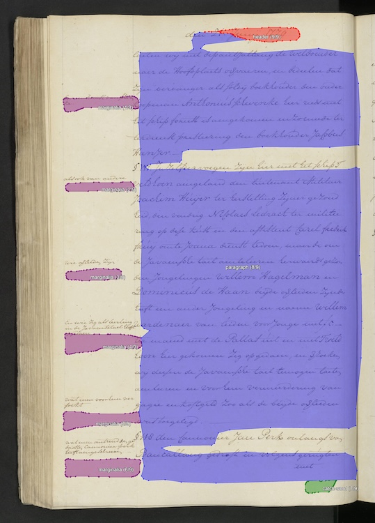

# PageXML Region Visualizer

## Overview

This script processes [PageXML](https://github.com/PRImA-Research-Lab/PAGE-XML) (Page Analysis and Ground-truth Elements) files and their corresponding JPG images to generate visualisations of text layout regions. The tool supports processing individual files or batch processing multiple files, along with options for generating statistics and recording the reading order sequence.

<p align="center">
  
  <br><em>NL-HaNA_1.04.02_1120_0710</em>
</p>

## Features

* **Visualise PageXML Regions:** Draws coloured rectangles (or polygons, if present) on JPG images corresponding to `<TextRegion>` elements in PageXML files. Uses distinct colours for different region types (header, paragraph, catch-word, page-number, marginalia, signature-mark) with a default fallback colour.
* **Region Labels:** Displays the region type, reading order index, and total region count directly on the visualisation.
* **Single File Processing:** Process a specific XML/JPG pair. Allows customisation of the label font size.
* **Batch Processing:** Process all XML and JPG files. Uses multiprocessing for efficiency. Allows skipping the generation of overlay images if only the statistics are needed.
* **Statistics:** Creates a TSV file (`region_counts.tsv`) summarising the total and count of each region type and a TSV file (`oregion_sequences.tsv`) detailing the reading order using layout region names, total region count, and the last region in the sequence for each processed XML file. 

## Directory Structure

The script expects the following directory structure:

```
your_project_directory/
├── images/                 # Input directory for JPG images
│   └── example1.jpg
│   └── example2.jpg
│   └── ...
├── xml/                    # Input directory for PageXML files
│   └── example1.xml
│   └── example2.xml
│   └── ...
├── output/                 # Output directory (created automatically)
│   ├── example1_overlay.jpg  
│   ├── example2_overlay.jpg
│   ├── region_counts.tsv
│   └── region_sequences.tsv  
└── page_visualizer.py      # The script itself
```

* Image and XML files corresponding to each other must share the same base name (e.g., `NL-HaNA_1.04.02_1153_0563.jpg` and `NL-HaNA_1.04.02_1153_0563.xml`).

## Prerequisites

* Python 3.7+ (due to features like dataclasses and type hints)
* pip or uv for installing dependencies.
* A TrueType font (e.g., Arial, DejaVu Sans, FreeSans, Noto Sans) installed on your system is recommended for optimal text rendering on overlays. The script includes fallbacks if these aren't found.

## Installation

1. **Get the Script:** Download the `page_visualizer.py` script into your project directory.
2. **Set up Input:** Place your .jpg scans in the images/ directory and corresponding PageXML files in the xml/ directory.
3. **Install Dependencies:** The only external dependency is `Pillow` (the PIL fork). Choose one of the following methods:

   **Method 1: Using `pip`**

   It's recommended to use a virtual environment:

   ```bash
   # Create a virtual environment
   python -m venv venv

   # Activate the virtual environment
   # On macOS/Linux:
   source venv/bin/activate
   # On Windows:
   .\venv\Scripts\activate

   # Install Pillow
   pip install Pillow
   ```

   **Method 2: Using `uv`**

   ```bash
   # Create and activate a virtual environment using uv
   uv venv

   # Install Pillow using uv
   uv pip install Pillow
   ```

## Usage

Run the script from your project directory where the `images/`, `xml/`, and script file reside. You can use either Python directly or `uv run <script> <base_filename> [options]` to execute the script.

### 1. Process a Single File:

```bash
python page_visualizer.py <base_filename> [options]
```

* `<base_filename>`: The name of the file pair to process, without the extension (e.g., example1).
* `--font-size <size>`: (Optional) Specify the font size for region labels (default is 48).
* `--stats`: (Optional) Generate region_counts.tsv and sequence_counts.tsv files for this single entry. 

#### Examples:

```bash
# Process 'example1.xml' and 'example1.jpg' with default font size
python page_visualizer.py example1

# Process 'document_abc.xml' and 'document_abc.jpg' with font size 48
python page_visualizer.py document_abc --font-size 48

# Process 'example1.xml' and generate statistics on its region counts and sequences
python page_visualizer.py example1 --stats
```

### 2. Process All Files (Batch Mode):

```bash
python page_visualizer.py --all [options]
```

* `--all`: Process all files in the xml/ and images/ directories. Generates output/region_counts.tsv and output/region_sequences.tsv files by default.
* `--no-overlays`: (Optional) Skip the creation of overlay images. Useful if you only need the statistics files.
* `--no-stats`: (Optional) Skip creating the statistics files.

#### Examples:

```bash
# Process all files, create overlays, and generate statistics TSV
python page_visualizer.py --all

# Process all files, generate statistics TSV, but do not create overlay images
python page_visualizer.py --all --no-overlays

# Process all files, do not generate statistics files
python page_visualizer.py --all --no-stats
```

## Output Files

* **Overlay Images** (`*_overlay.jpg`): These are copies of the input JPGs with coloured polygons and labels drawn over the text regions showing their position in the reading order index. 
* **Region Statistics**
  * (`region_counts.tsv`): A tab-separated file with columns: `filename`: The base name of the processed file.`total_regions`: The total number of <TextRegion> elements found. `count_<region_type>`: Columns for each unique region type found across all files (e.g., `count_paragraph`, `count_header`), showing the count for that file.
  * (`region_sequences.tsv`): A tab-separated file with columns: `filename`: The base name of the processed file. `total_regions`: Total count of <TextRegion> elements in the XML. `last_region`: The layout name (type) of the final region in the reading order. `region_sequence`: Comma-separated list of region layout names (types) in their reading order.

## Configuration

Default settings like directory names (images, xml, output), region colours, default font size, and output filenames can be modified directly in the script if needed.

## Credits

Original version of the script written by Gavin Lip. Further baroque additions and refinements prompted by Arno Bosse and implemented by Claude Sonnet 3.7 and OpenAI o3-mini-high.
